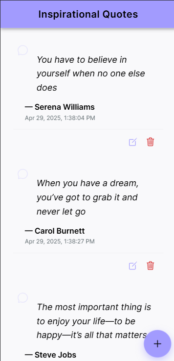

# Inspirational Quote Management

A modern mobile and web application for managing your favorite inspirational quotes, built with Ionic and Angular.

## 📱 App Screenshots

<div align="center">
  <div style="display: inline-block; margin: 0 10px; text-align: center;">
    <p><strong>Home Screen with Quote List</strong></p>
    
  </div>
  <div style="display: inline-block; margin: 0 10px; text-align: center;">
    <p><strong>Add/Edit Quote Form</strong></p>
    
  </div>
</div>

## 📱 Features

- **Create and Store Quotes**: Add your favorite inspirational quotes with author attribution
- **Modern UI**: Clean and intuitive interface with responsive design
- **Edit Functionality**: Modify existing quotes when needed
- **Delete with Confirmation**: Safely remove quotes with a confirmation dialog
- **Offline Storage**: All quotes are stored locally on the device
- **Empty State Handling**: Friendly guidance when no quotes exist

## 🛠️ Technology Stack

- **Frontend Framework**: Angular 19
- **UI Components**: Ionic 8
- **Local Storage**: Ionic Storage
- **Unique IDs**: UUID library
- **Reactive Programming**: RxJS
- **Icons**: Ionicons
- **Form Management**: Angular Reactive Forms

## 📋 Application Structure

```
src/
├── app/
│   ├── models/
│   │   └── quote.model.ts      # Quote data model
│   ├── services/
│   │   └── quotes.service.ts   # Quote management service
│   ├── home/                   # Main page component
│   │   ├── home.page.html      # UI template
│   │   ├── home.page.scss      # Styling
│   │   └── home.page.ts        # Component logic
│   ├── app.component.ts        # Root component
│   └── app.routes.ts           # Application routing
└── assets/
    └── icon/                   # App icons
```

## 💾 Data Flow

The application follows a clean data flow architecture:

```
┌───────────┐     ┌───────────┐     ┌───────────┐
│           │     │           │     │           │
│  UI/View  │◄────┤  Service  │◄────┤  Storage  │
│           │     │           │     │           │
└───────────┘     └───────────┘     └───────────┘
     ▲                 │                  ▲
     │                 ▼                  │
     └─────────────────────────────────────┘
```

1. The UI displays quotes from the Quotes Service
2. User interactions trigger Service methods
3. The Service updates the local storage and notifies subscribers
4. The UI automatically updates with the new data

## 📊 Core Components

### Quote Model

```typescript
export interface Quote {
  id: string;        // Unique identifier
  content: string;   // The quote text
  author: string;    // Who said/wrote the quote
  createdAt: Date;   // When the quote was added
}
```

### Quotes Service

The `QuotesService` handles all quote operations:

- **getQuotes()**: Retrieves all quotes as an Observable
- **addQuote()**: Creates and stores a new quote
- **updateQuote()**: Modifies an existing quote
- **deleteQuote()**: Removes a quote by ID

The service uses a `BehaviorSubject` to provide reactive updates to subscribers.

## 🔄 User Flow

```
┌─────────┐     ┌─────────────┐     ┌─────────────┐
│         │     │             │     │             │
│  Start  │────►│  View List  │────►│  Add Quote  │
│         │     │             │     │             │
└─────────┘     └─────────────┘     └──────┬──────┘
                       ▲                   │
                       │                   ▼
                 ┌─────┴───────┐     ┌─────────────┐
                 │             │     │             │
                 │  Save Quote │◄────┤ Enter Data  │
                 │             │     │             │
                 └─────────────┘     └─────────────┘
```

## 🎨 UI Components

1. **Header**: Application title and branding
2. **Quote List**: Card-based display of all saved quotes
3. **Quote Form**: Input fields for adding/editing quotes
4. **Empty State**: Helpful guidance when no quotes exist
5. **FAB Button**: Floating action button to add new quotes
6. **Action Buttons**: Edit and delete options for each quote

## ⚙️ Getting Started

### Prerequisites

- Node.js (v18+)
- npm or yarn
- Ionic CLI

### Installation

1. Clone the repository:
```bash
git clone https://github.com/yourusername/quote-management.git
cd quote-management
```

2. Install dependencies:
```bash
npm install
```

3. Run the application:
```bash
ionic serve
```

## 📱 Mobile Deployment

### Android

```bash
ionic capacitor add android
ionic capacitor copy android
ionic capacitor open android
```

### iOS

```bash
ionic capacitor add ios
ionic capacitor copy ios
ionic capacitor open ios
```

## 🧪 Testing

Run the test suite:

```bash
npm test
```

## 🚀 Build for Production

```bash
ionic build --prod
```

## 📄 License

This project is licensed under the MIT License - see the LICENSE file for details.

## 👤 Author

Created by Youssef Faik